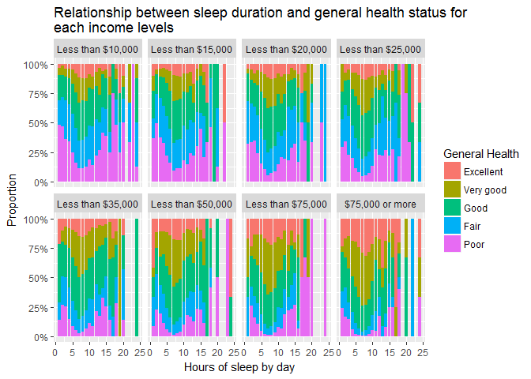
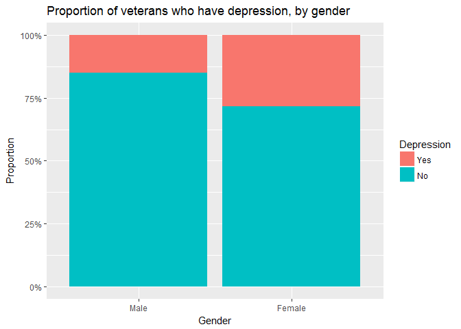
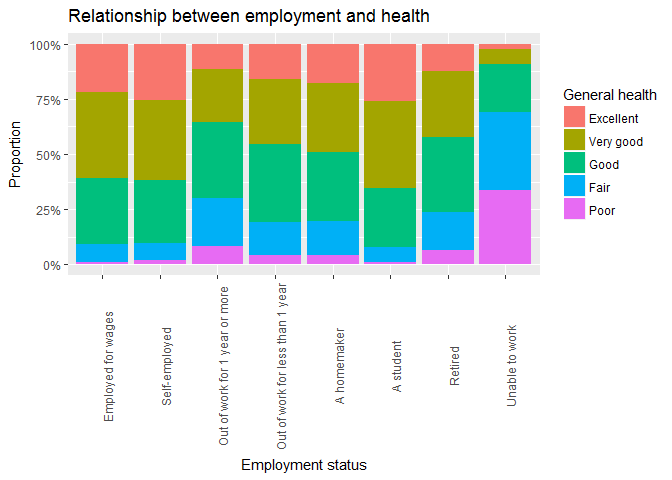

## Setup
### Load packages


```r
library(ggplot2)
library(dplyr)
```

### Load data

```r
load("brfss2013.RData")
```

* * *

## Part 1: Data

 The Behavioral Risk Factor Surveillance System (BRFSS) is a collaborative project between all of the states in the United States (US) and participating US territories and the Centers for Disease Control and Prevention (CDC). The BRFSS is administered and supported by CDC's Population Health Surveillance Branch, under the Division of Population Health at the National Center for Chronic Disease Prevention and Health Promotion. BRFSS is an ongoing surveillance system designed to measure behavioral risk factors for the non-institutionalized adult population (18 years of age and older) residing in the US. The BRFSS was initiated in 1984, with 15 states collecting surveillance data on risk behaviors through monthly telephone interviews.

 The BRFSS objective is to collect uniform, state-specific data on preventive health practices and risk behaviors that are linked to chronic diseases, injuries, and preventable infectious diseases that affect the adult population. Factors assessed by the BRFSS in 2013 include tobacco use, HIV/AIDS knowledge and prevention, exercise, immunization, health status, healthy days — health-related quality of life, health care access, inadequate sleep, hypertension awareness, cholesterol awareness, chronic health conditions, alcohol consumption, fruits and vegetables consumption, arthritis burden, and seatbelt use. Since 2011, BRFSS conducts both landline telephone- and cellular telephone-based surveys. In conducting the BRFSS landline telephone survey, interviewers collect data from a **randomly** selected adult in a household. In conducting the cellular telephone version of the BRFSS questionnaire, interviewers collect data from an adult who participates by using a cellular telephone and resides in a private residence or college housing. 
     
 The survey is conducted using Random Digit Dialing (RDD) techniques on both landlines and cell phones. This study is an observational study, the data are collected in a way that does not directly infer with how the data arise. The observational nature of the study is only allowing us to make correlation statement but no causality statement.

> Original dataset is [here](http://www.cdc.gov/brfss/annual_data/2013/files/LLCP2013ASC.ZIP).

> Codebook for the dataset is [here](https://www.cdc.gov/brfss/annual_data/2013/pdf/codebook13_llcp.pdf).

* * *

## Part 2: Research questions

**Question 1:**
In this question We are interested in a relationship between general health and sleep duration of survey participants. And how this relationship looks in a context of participants income level?

**Question 2:**
What percentage of survey participants who are veterans have a depressive disorder or depression? Does it look the same if the veteran is a male or a female?

**Question 3:**
Is there a relationship between general health and employment status of survey participants? And how this relationship looks in a context of participants income level? 

* * *

## Part 3: Exploratory data analysis

Description of the dataset variables that are used in our analysis:

* *genhlth*, Would you say that in general your health is: 

     * 1 - Excellent
     * 2 - Very good
     * 3 - Good
     * 4 - Fair
     * 5 - Poor
     * 7 - Don’t know/Not Sure
     * 9 - Refused
     * BLANK - Not asked or Missing)
     
* *sleptim1*, On average, how many hours of sleep do you get in a 24-hour period? 
     
     * 1:24 - Number of hours [1-24]
     * 77 - Don’t know/Not Sure
     * 99 - Refused
     
* *addepev2*, (Ever told) you that you have a depressive disorder, including depression, major depression, dysthymia, or minor depression? 

     * 1 - Yes
     * 2 - No
     * 7 - Don’t know/Not sure
     * 9 - Refused
     
* *veteran3*, Have you ever served on active duty in the United States Armed Forces, either in the regular military or in a National Guard or military reserve unit? (Active duty does not include training for the Reserves or National Guard, but DOES include activation, for example, for the Persian Gulf War.) 

     * 1 - Yes
     * 2 - No
     * 7 - Don’t know/Not Sure
     * 9 - Refused
     * BLANK - Not asked or Missing
     
* *employ1*, Are you currently…? 

     * 1 - Employed for wages
     * 2 - Self-employed
     * 3 - Out of work for 1 year or more
     * 4 - Out of work for less than 1 year
     * 5 - A homemaker
     * 6 - A student
     * 7 - Retired
     * 8 - Unable to work
     * 9 - Refused
     * BLANK - Not asked or Missing
     
* *sex*, Indicate sex of respondent. 

     * 1 - Male
     * 2 - Female
     
* *income2*, Is your annual household income from all sources: 

     * 1 - Less than $10,000 
     * 2 - Less than $15,000 ($10,000 to less than $15,000)
     * 3 - Less than $20,000 ($15,000 to less than $20,000)
     * 4 - Less than $25,000 ($20,000 to less than $25,000)
     * 5 - Less than $35,000 ($25,000 to less than $35,000) 
     * 6 - Less than $50,000 ($35,000 to less than $50,000)
     * 7 - Less than $75,000 ($50,000 to less than $75,000)
     * 8 - $75,000 or more
     * 77 - Don’t know/Not sure
     * 99 - Refused
     * BLANK - Not asked or Missing

At first subset only our variables of interest:

```r
brfss2013 <- brfss2013 %>% 
     select(genhlth, sleptim1, addepev2, veteran3, employ1, sex, income2)
```

Cause almost all of our variables are categorical we decided to use bar plots. NA and other inappropriate values are omitted from analysis.  

**Research question 1:**


```r
brfss2013 %>% 
     select(sleptim1, income2, genhlth) %>%
     filter(!is.na(genhlth) & !is.na(sleptim1) & !is.na(income2) & sleptim1 %in% 1:24) %>%
     ggplot(aes(x=sleptim1, fill=genhlth)) +
     geom_bar(position = "fill") + 
     scale_y_continuous(labels = scales::percent) + 
     labs(x = "Hours of sleep by day", y = "Proportion", title = "Relationship between sleep duration and general health status for \neach income levels") +
     facet_wrap(~income2, ncol = 4) + 
     scale_fill_discrete(name = "General Health")
```

<!-- -->

We see that those participants who have normal daily sleep duration (about 7-8 hours of sleep) feel better than rest. And also participants with higher income have a better health than those with lower income.

**Research question 2:**


```r
brfss2013 %>% 
     select(addepev2, veteran3, sex) %>%
     filter(addepev2 %in% c("Yes", "No") & veteran3 == "Yes") %>% 
     ggplot(aes(x = sex, fill = addepev2)) + 
     geom_bar(position = "fill") + 
     scale_y_continuous(labels = scales::percent) + 
     labs(x = "Gender", y = "Proportion", title = "Proportion of veterans who have depression, by gender") +
     scale_fill_discrete(name = "Depression")
```

<!-- -->

Nearly 20-25% of survey participants who are veterans have a depressive disorder or depression. And percentage of them is two times bigger among female veterans than male veterans. 

**Research quesion 3:**


```r
brfss2013 %>%
     select(employ1, genhlth) %>%
     filter(!is.na(employ1) & !is.na(genhlth)) %>%
     ggplot(aes(x = employ1, fill = genhlth)) + 
     geom_bar(position = "fill") + 
     theme(axis.text.x = element_text(angle = 90)) + 
     scale_y_continuous(labels = scales::percent) +
     labs(x = "Employment status", y = "Proportion", title = "Relationship between employment and health") +
     scale_fill_discrete(name = "General health")
```

<!-- -->

As we can see in figure, employed participants have a better health statuses than unemployed ones.  
